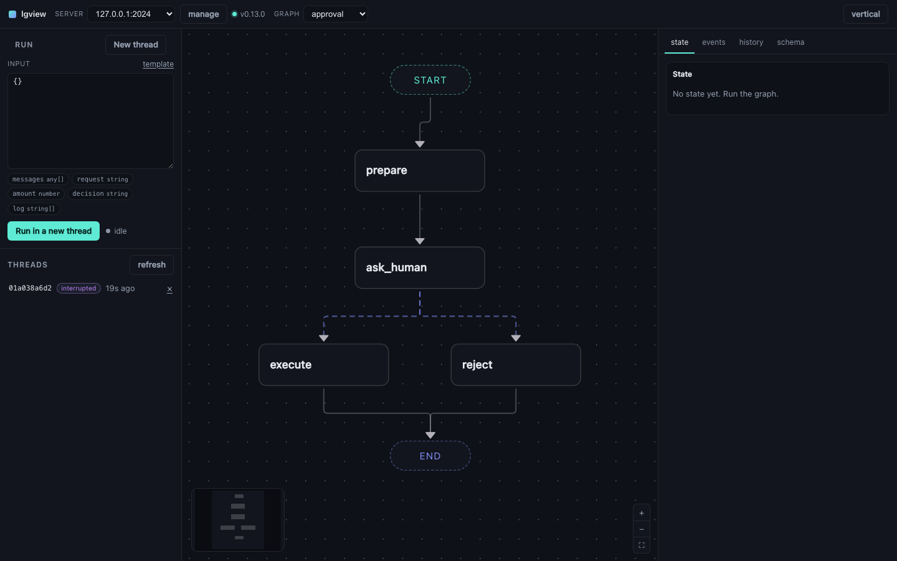

# lgview

A fast, local, open-source web UI for any LangGraph server.

Point it at `langgraph dev` and you get your graph on a canvas, its state as it
changes, and every run streamed node by node. No login, no account, no Docker,
nothing leaves your machine.

```bash
langgraph dev          # in your agent project
npx lgview             # in another terminal
```



## Why this exists

LangGraph Studio is good, and it is also a hosted product: it wants a LangSmith
login even to look at a graph running on your own laptop. lgview is the small
local alternative — one npm package, one command, no account.

It reads. It does not author. Your code stays the source of truth: lgview never
writes a line of it, and when you save a file and `langgraph dev` hot-reloads,
the canvas follows within a couple of seconds.

## What you get

<div class="grid cards" markdown>

-   __The graph, laid out__

    Nodes and edges straight from the server, arranged with dagre. Conditional
    edges are dashed, because the canvas can honestly show you *that* a router
    fans out to three places but never *why* — that lives in your Python.

-   __Runs you can watch__

    Every node lights up as it executes and reports how long it took. Loops
    count their iterations (`write_draft ×3`). A failed node goes red and says
    so; it does not quietly report success.

-   __State, live__

    The full state after each step, as a collapsible tree. Click a node to see
    exactly what it returned.

-   __Interrupts, answered in place__

    When a graph calls `interrupt()`, the question appears with its options as
    buttons. Answer it and the run resumes.

-   __Time travel__

    Every checkpoint is listed with its step number and what was going to run
    next. "Resume from here" forks the thread from that point.

-   __Threads and an event log__

    Create, switch, inspect, delete. Every server-sent event, decoded and
    timestamped.

</div>

## What it deliberately does not do

**Author graphs.** Code is the source of truth. LangChain's own canvas-to-code
tool, LangGraph Builder, was archived in February 2026; the round trip between
a canvas and real Python is where these tools go to die. If the canvas and your
code disagree, the canvas is stale — that's the whole contract.

**Show routing conditions.** A conditional edge is drawn dashed. The predicate
that chooses the branch is arbitrary Python and is not something the server
serializes, so pretending otherwise would be a lie.

**Replace LangSmith.** No tracing, no evals, no datasets.

## Next

- [Getting started](getting-started.md) — install it and point it at something
- [How it works](reference/architecture.md) — the proxy, and why there is one
- [Security](security.md) — what the proxy does and how it is guarded
